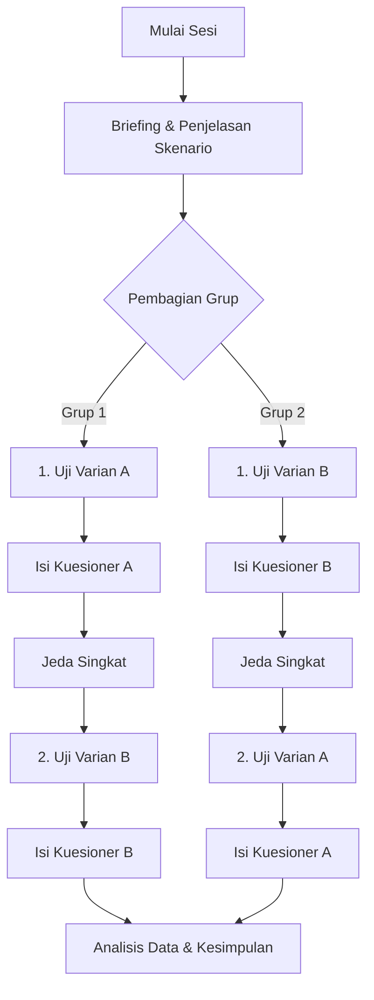

# Rencana Pengujian A/B Testing - Aplikasi LaporJalan
Dokumen ini mendokumentasikan skenario pengujian A/B testing untuk mengukur efektivitas dan kepuasan pengguna terhadap varian desain aplikasi **LaporJalan**.

---

## 🚧 UC1 — Navigasi Mulai Melapor

### 1. Deskripsi Varian
* **Varian A (Navbar Entry Point):** Tombol lapor diletakkan pada bagian Navbar Header (`+ Lapor`). Penempatan ini meniru pola navigasi web klasik yang statis di bagian atas.
* **Varian B (Contextual FAB Entry Point):** Tombol lapor diletakkan dalam bentuk *Floating Action Button* (FAB) melayang di sudut kanan bawah layar, langsung di atas komponen Peta. Penempatan ini dirancang agar lebih mudah dijangkau dengan ibu jari (ergonomis) pada perangkat mobile.

### 2. Tujuan Pengujian
Mengetahui apakah posisi peletakan tombol melapor berpengaruh secara signifikan terhadap kecepatan pengguna (*Time to First Click*) dan kenyamanan pengguna saat ingin memulai pelaporan jalan rusak.

### 3. Metrik Pengukuran

| Metrik | Definisi Operasional | Cara Mengukur |
| :--- | :--- | :--- |
| **Time to First Click (TTFC)** | Waktu yang dibutuhkan pengguna sejak halaman dimuat hingga mengklik tombol untuk memulai laporan baru. | Diukur menggunakan *stopwatch* atau melalui analisis rekaman layar (dalam satuan detik/milidetik). |
| **User Satisfaction (Skala Likert)** | Tingkat kemudahan dan kepuasan pengguna dalam menjangkau tombol pelaporan. | Diberikan kuesioner singkat setelah mencoba masing-masing varian. |

#### Pertanyaan Skala Likert:
> **"Seberapa mudah kamu menjangkau tombol untuk memulai pelaporan?"**
* **Skor 1:** Sulit dijangkau
* **Skor 2:** Cukup mudah dijangkau
* **Skor 3:** Sangat mudah dijangkau

---

### 4. Prosedur Pelaksanaan (Within-Subject & Counterbalancing)
Untuk menghindari bias pembelajaran (efek urutan), pengujian dilakukan menggunakan desain *within-subject* dengan metode penyilangan (*counterbalancing*) sebagai berikut:

#### Langkah-Langkah Detil:
1. **Persiapan:** 
   * Siapkan aplikasi LaporJalan.
   * Pastikan *Floating Variant Controller* (di pojok kiri bawah) berfungsi dengan baik untuk mengganti varian secara instan.
   * Bagi partisipan secara acak menjadi dua grup (Grup 1 dan Grup 2).
2. **Briefing:**
   * Jelaskan tujuan pengujian secara umum kepada partisipan.
   * Tekankan bahwa yang sedang diuji adalah **desain aplikasi**, bukan kemampuan atau inteligensi partisipan.
   * Minta partisipan untuk berinteraksi secara natural.
3. **Sesi Pengujian:**
   * **Grup 1:** 
     1. Set aplikasi ke **Varian A**. Minta partisipan membuka Beranda/Peta dan berikan instruksi: *"Silakan laporkan jalan rusak yang Anda temui."* Catat waktu (TTFC).
     2. Minta partisipan mengisi kuesioner kepuasan Varian A.
     3. Berikan jeda singkat (sekitar 1-2 menit).
     4. Set aplikasi ke **Varian B**. Minta partisipan melakukan tugas yang sama. Catat waktu (TTFC).
     5. Minta partisipan mengisi kuesioner kepuasan Varian B.
   * **Grup 2:** 
     1. Set aplikasi ke **Varian B**. Berikan tugas yang sama dan catat TTFC.
     2. Minta mengisi kuesioner kepuasan Varian B.
     3. Berikan jeda singkat.
     4. Set aplikasi ke **Varian A**. Berikan tugas yang sama dan catat TTFC.
     5. Minta mengisi kuesioner kepuasan Varian A.

---

### 5. Lembar Pencatatan Data (Template)

Gunakan tabel di bawah ini untuk mencatat hasil pengujian dari setiap partisipan:

| ID Partisipan | Grup | TTFC Varian A (detik) | Skor Likert Varian A (1-3) | TTFC Varian B (detik) | Skor Likert Varian B (1-3) | Catatan Kualitatif / Observasi |
| :--- | :--- | :--- | :--- | :--- | :--- | :--- |
| P01 | Grup 1 | | | | | |
| P02 | Grup 2 | | | | | |
| P03 | Grup 1 | | | | | |
| P04 | Grup 2 | | | | | |
| P05 | Grup 1 | | | | | |
| P06 | Grup 2 | | | | | |
| **Rata-rata**| **-** | **[Rerata A]** | **[Rerata Likert A]** | **[Rerata B]** | **[Rerata Likert B]** | |

---

### 6. Metode Analisis Data
* **Kecepatan Akses (TTFC):** Bandingkan nilai rata-rata (*mean*) TTFC antara Varian A dan Varian B. Varian dengan nilai TTFC lebih kecil adalah yang lebih efisien bagi pengguna untuk memulai pelaporan.
* **Kepuasan (Likert):** Bandingkan nilai rata-rata skor Likert kepuasan jangkauan tombol. Varian dengan skor lebih tinggi mendekati 3 dianggap memiliki jangkauan tombol yang lebih ergonomis dan memuaskan.
* **Uji Hipotesis (Opsional):** Jika jumlah sampel partisipan mencukupi (misal $N \ge 10$), gunakan *Paired t-Test* or *Wilcoxon Signed-Rank Test* untuk melihat signifikansi perbedaan antara kedua varian tersebut.
